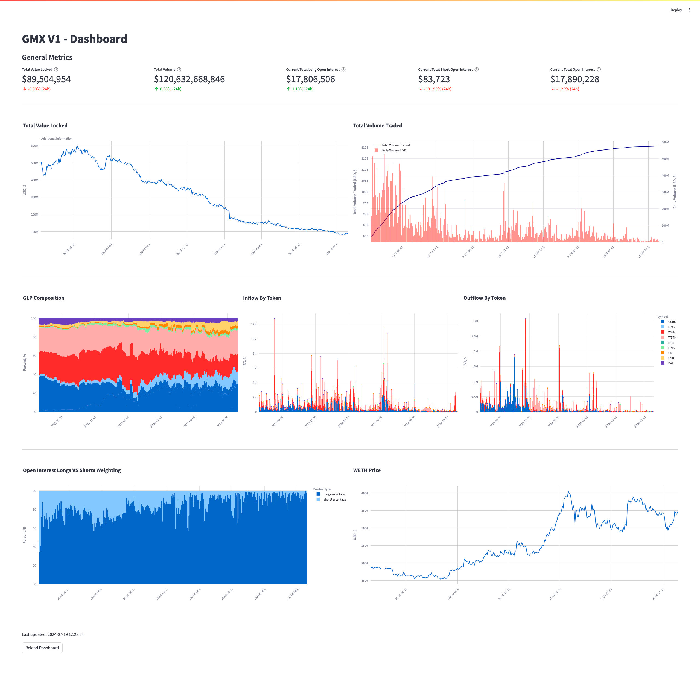

# GMX V1 Dashboard with Streamlit (Work in Progress)

This project utilizes Streamlit to create an interactive dashboard for GMX V1 data analysis and visualization.

## Overview

The GMX V1 Dashboard is designed to provide insights and visualizations for the GMX V1 protocol. It fetches data via GraphQL, processes it, and presents it in a user-friendly interface using Streamlit.

## Features

- **Data Visualization**: Utilizes Plotly and other visualization libraries to present data interactively.
- **Data Fetching**: Automatically fetches updated data at regular intervals.
- **User-Friendly Interface**: Designed for ease of use and clarity in presenting complex data.

# Screenshots

